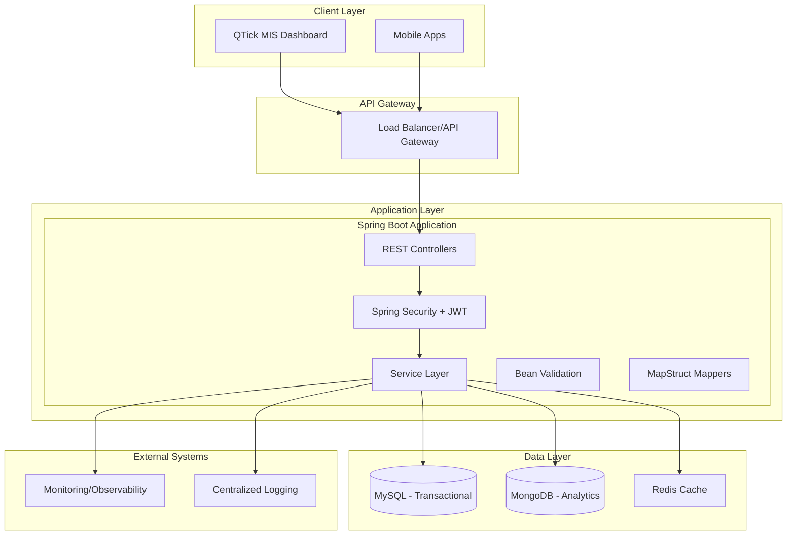
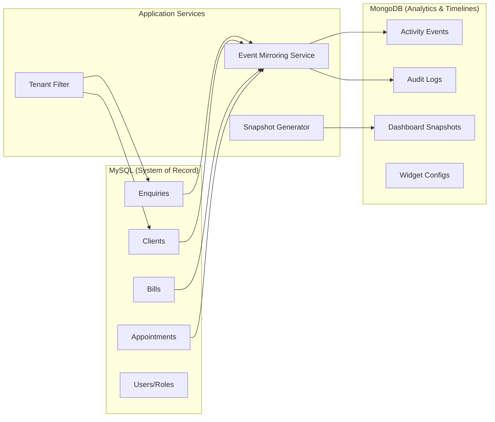

# Design Document

## Overview

The QTick MIS Backend is a Spring Boot 3.x REST API service built with Java 21 that serves as the data layer for a multi-tenant business management dashboard. The system implements a dual-database architecture using MySQL for transactional data and MongoDB for analytics snapshots and activity timelines, ensuring optimal performance for both operational and analytical workloads.

The service follows Domain-Driven Design principles with clear separation between the API layer, service layer, and data access layer. Multi-tenancy is enforced through JWT-based authentication with business and branch scoping, while role-based access control ensures appropriate data visibility.

## Architecture

### High-Level Architecture



### Multi-Tenant Data Architecture



## Components and Interfaces

### REST Controller Layer

**DashboardController**
- `GET /api/v1/dashboard/summary` - Business KPI summary with comparison
- `GET /api/v1/dashboard/trends` - Time series data for charts
- `GET /api/v1/dashboard/top-services` - Top performing services
- `GET /api/v1/dashboard/top-staff` - Staff performance rankings
- `GET /api/v1/dashboard/highlights` - Business insights and anomalies
- `GET /api/v1/dashboard/business-details` - Existing client business details by business type with daily job statistics

**PipelineController**
- `GET /api/v1/pipeline/summary` - Sales funnel overview
- `GET /api/v1/pipeline/enquiries` - Paginated enquiry search
- `GET /api/v1/pipeline/enquiries/{id}` - Enquiry details
- `POST /api/v1/pipeline/enquiries` - Create new enquiry
- `PATCH /api/v1/pipeline/enquiries/{id}` - Update enquiry
- `GET /api/v1/pipeline/enquiries/{id}/threads` - Enquiry communication history
- `POST /api/v1/pipeline/enquiries/{id}/threads` - Add communication thread

**ClientController**
- `GET /api/v1/clients` - Client search and listing
- `GET /api/v1/clients/{id}` - Client profile details
- `GET /api/v1/clients/{id}/timeline` - Client activity timeline
- `GET /api/v1/clients/{id}/bills` - Client billing history
- `GET /api/v1/clients/{id}/appointments` - Client appointments
- `GET /api/v1/clients/{id}/services` - Client service history
- `GET /api/v1/clients/{id}/points` - Loyalty points ledger
- `GET /api/v1/clients/{id}/devices` - Client device information

**AnalyticsController**
- `GET /api/v1/analytics/kpis` - Aggregate business KPIs
- `GET /api/v1/analytics/services` - Service performance analytics
- `GET /api/v1/analytics/staff` - Staff performance analytics
- `GET /api/v1/analytics/funnel` - Sales conversion funnel
- `GET /api/v1/analytics/marketing` - Marketing campaign performance
- `GET /api/v1/analytics/retention` - Customer retention analysis

### Service Layer

**DashboardService**
```java
@Service
public class DashboardService {
    DashboardSummaryDto getSummary(DashboardQuery query);
    List<TrendDataDto> getTrends(TrendQuery query);
    List<TopServiceDto> getTopServices(TopQuery query);
    List<TopStaffDto> getTopStaff(TopQuery query);
    DashboardHighlightsDto getHighlights(HighlightsQuery query);
    List<BusinessDetailsDto> getBusinessDetails(BusinessDetailsQuery query);
}
```

**PipelineService**
```java
@Service
public class PipelineService {
    PipelineSummaryDto getSummary(PipelineQuery query);
    Page<EnquiryDto> searchEnquiries(EnquirySearchQuery query, Pageable pageable);
    EnquiryDetailDto getEnquiry(Long enquiryId, TenantContext context);
    EnquiryDto createEnquiry(CreateEnquiryDto request, TenantContext context);
    EnquiryDto updateEnquiry(Long enquiryId, UpdateEnquiryDto request, TenantContext context);
    List<EnquiryThreadDto> getThreads(Long enquiryId, TenantContext context);
    EnquiryThreadDto addThread(Long enquiryId, CreateThreadDto request, TenantContext context);
}
```

**ClientService**
```java
@Service
public class ClientService {
    Page<ClientSummaryDto> searchClients(ClientSearchQuery query, Pageable pageable);
    ClientDetailDto getClient(Long clientId, TenantContext context);
    List<TimelineEventDto> getTimeline(Long clientId, TenantContext context);
    Page<BillDto> getBills(Long clientId, TenantContext context, Pageable pageable);
    List<AppointmentDto> getAppointments(Long clientId, TenantContext context);
    List<ClientServiceDto> getServices(Long clientId, TenantContext context);
    PointsLedgerDto getPoints(Long clientId, TenantContext context);
    List<ClientDeviceDto> getDevices(Long clientId, TenantContext context);
}
```

**AnalyticsService**
```java
@Service
public class AnalyticsService {
    AnalyticsKpiDto getKpis(AnalyticsQuery query);
    ServiceAnalyticsDto getServiceAnalytics(ServiceAnalyticsQuery query);
    StaffAnalyticsDto getStaffAnalytics(StaffAnalyticsQuery query);
    FunnelAnalyticsDto getFunnelAnalytics(FunnelQuery query);
    MarketingAnalyticsDto getMarketingAnalytics(MarketingQuery query);
    RetentionAnalyticsDto getRetentionAnalytics(RetentionQuery query);
}
```

### Security and Multi-Tenancy

**TenantContext**
```java
public class TenantContext {
    private Long userId;
    private Long bizId;
    private Set<Long> branchIds;
    private Set<String> roles;
    private String timezone;
}
```

**JWT Security Configuration**
```java
@Configuration
@EnableWebSecurity
public class SecurityConfig {
    @Bean
    public JwtDecoder jwtDecoder();
    
    @Bean
    public JwtAuthenticationConverter jwtAuthenticationConverter();
    
    @Bean
    public SecurityFilterChain filterChain(HttpSecurity http);
}
```

## Data Models

### MySQL Entities

**Enquiry Entity**
```java
@Entity
@Table(name = "enquiries")
public class Enquiry {
    @Id
    @GeneratedValue(strategy = GenerationType.IDENTITY)
    private Long id;
    
    @Column(nullable = false)
    private Long bizId;
    
    private Long branchId;
    private Long custId;
    private String name;
    private String phone;
    private String email;
    
    @Enumerated(EnumType.STRING)
    private EnquiryType enqType;
    
    private Long srvcEnq;
    
    @Enumerated(EnumType.STRING)
    private EnquiryStage stage;
    
    @Enumerated(EnumType.STRING)
    private EnquiryStatus status;
    
    private String source;
    private String channel;
    private Long assigneeId;
    private LocalDateTime reContactOn;
    private String nextAction;
    private LocalDateTime lastTouchDate;
    private LocalDateTime closureDate;
    
    @CreationTimestamp
    private LocalDateTime createdOn;
    
    @UpdateTimestamp
    private LocalDateTime updatedOn;
    
    @OneToMany(mappedBy = "enquiry", cascade = CascadeType.ALL)
    private List<EnquiryThread> threads;
}
```

**Client Entity**
```java
@Entity
@Table(name = "clients")
public class Client {
    @Id
    @GeneratedValue(strategy = GenerationType.IDENTITY)
    private Long custId;
    
    @Column(nullable = false)
    private Long bizId;
    
    private String name;
    private String email;
    private String phone;
    private LocalDate dob;
    private String gender;
    private String address;
    
    @CreationTimestamp
    private LocalDateTime createdOn;
    
    @UpdateTimestamp
    private LocalDateTime updatedOn;
    
    @OneToMany(mappedBy = "client")
    private List<Bill> bills;
    
    @OneToMany(mappedBy = "client")
    private List<Appointment> appointments;
    
    @OneToMany(mappedBy = "client")
    private List<PointsTransaction> pointsTransactions;
}
```

### MongoDB Documents

**ActivityEvent Document**
```java
@Document(collection = "activity_events")
public class ActivityEvent {
    @Id
    private String id;
    
    private Long bizId;
    private Long branchId;
    private String eventType;
    private String entityType;
    private Long entityId;
    private String description;
    private Map<String, Object> metadata;
    
    @CreatedDate
    private LocalDateTime createdAt;
    
    private Long userId;
    private String userRole;
}
```

**DashboardSnapshot Document**
```java
@Document(collection = "dashboard_snapshots")
public class DashboardSnapshot {
    @Id
    private String id;
    
    private Long bizId;
    private Long branchId;
    private LocalDate snapshotDate;
    private String period; // daily, weekly, monthly
    
    private BigDecimal grossSales;
    private BigDecimal netSales;
    private Integer bills;
    private BigDecimal avgBill;
    private Integer newLeads;
    private Integer totalLeads;
    private Integer missedLeads;
    private Integer appointments;
    private Integer returningCustomers;
    
    @CreatedDate
    private LocalDateTime createdAt;
}
```

**BusinessDetailsDto**
```java
public class BusinessDetailsDto {
    private Long custId;
    private String businessName;
    private String businessType;
    private String contactPerson;
    private String phone;
    private String email;
    private LocalDate lastVisit;
    private DailyJobStatsDto dailyStats;
}

public class DailyJobStatsDto {
    private LocalDate date;
    private Integer totalAppointments;
    private Integer totalWalkIns;
    private Integer totalBills;
    private BigDecimal totalRevenue;
    private List<ServiceBreakdownDto> serviceBreakdown;
}

public class ServiceBreakdownDto {
    private String serviceName;
    private Integer appointmentCount;
    private Integer walkInCount;
    private Integer billCount;
    private BigDecimal revenue;
}
```

## Error Handling

### Global Exception Handler

```java
@RestControllerAdvice
public class GlobalExceptionHandler {
    
    @ExceptionHandler(ValidationException.class)
    public ResponseEntity<ErrorResponse> handleValidation(ValidationException ex);
    
    @ExceptionHandler(EntityNotFoundException.class)
    public ResponseEntity<ErrorResponse> handleNotFound(EntityNotFoundException ex);
    
    @ExceptionHandler(AccessDeniedException.class)
    public ResponseEntity<ErrorResponse> handleAccessDenied(AccessDeniedException ex);
    
    @ExceptionHandler(DataIntegrityViolationException.class)
    public ResponseEntity<ErrorResponse> handleDataIntegrity(DataIntegrityViolationException ex);
    
    @ExceptionHandler(Exception.class)
    public ResponseEntity<ErrorResponse> handleGeneral(Exception ex);
}
```

### Error Response Structure

```java
public class ErrorResponse {
    private String code;
    private String message;
    private List<String> details;
    private LocalDateTime timestamp;
    private String path;
}
```

## Testing Strategy

### Unit Testing
- Service layer unit tests with mocked dependencies
- Repository layer tests using @DataJpaTest and @DataMongoTest
- Controller tests using @WebMvcTest with mocked services
- Security configuration tests for JWT validation and RBAC

### Integration Testing
- Full application context tests using @SpringBootTest
- Database integration tests with Testcontainers for MySQL and MongoDB
- REST API contract tests using RestAssured
- Multi-tenant data isolation tests

### Performance Testing
- Load testing with k6 for API endpoints
- Database query performance testing
- Cache effectiveness testing
- Memory and CPU profiling under load

### Test Data Strategy
- Seed datasets that mirror UI filter scenarios
- Multi-tenant test data with proper isolation
- Performance test datasets with realistic data volumes
- Automated test data cleanup and refresh

## Deployment and Operations

### Application Profiles

**Local Development (application-local.yml)**
```yaml
spring:
  datasource:
    url: jdbc:mysql://localhost:3306/qtick_local
  data:
    mongodb:
      uri: mongodb://localhost:27017/qtick_local
  security:
    oauth2:
      resourceserver:
        jwt:
          jwk-set-uri: http://localhost:8080/.well-known/jwks.json
```

**Production (application-prod.yml)**
```yaml
spring:
  datasource:
    url: ${DB_URL}
    username: ${DB_USERNAME}
    password: ${DB_PASSWORD}
  data:
    mongodb:
      uri: ${MONGO_URI}
  security:
    oauth2:
      resourceserver:
        jwt:
          jwk-set-uri: ${JWT_JWK_SET_URI}
```

### Docker Configuration

```dockerfile
FROM openjdk:21-jdk-slim
COPY target/qtick-mis-backend.jar app.jar
EXPOSE 8080
ENTRYPOINT ["java", "-jar", "/app.jar"]
```

### Kubernetes Deployment

```yaml
apiVersion: apps/v1
kind: Deployment
metadata:
  name: qtick-mis-backend
spec:
  replicas: 3
  selector:
    matchLabels:
      app: qtick-mis-backend
  template:
    metadata:
      labels:
        app: qtick-mis-backend
    spec:
      containers:
      - name: qtick-mis-backend
        image: qtick/mis-backend:latest
        ports:
        - containerPort: 8080
        env:
        - name: SPRING_PROFILES_ACTIVE
          value: "prod"
        resources:
          requests:
            memory: "512Mi"
            cpu: "250m"
          limits:
            memory: "1Gi"
            cpu: "500m"
```

### Monitoring and Observability

**Metrics Collection**
- Micrometer metrics for JVM, HTTP requests, database connections
- Custom business metrics for enquiry conversion rates, response times
- Database query performance metrics

**Logging Strategy**
- Structured JSON logging with correlation IDs
- PII masking for sensitive data
- Audit logging for all write operations
- Log aggregation with ELK stack or similar

**Health Checks**
- Spring Boot Actuator health endpoints
- Database connectivity checks
- JWT validation service checks
- Custom business logic health indicators

This design provides a robust, scalable foundation for the QTick MIS Backend that meets all the requirements while following Spring Boot best practices and ensuring optimal performance for both operational and analytical workloads.